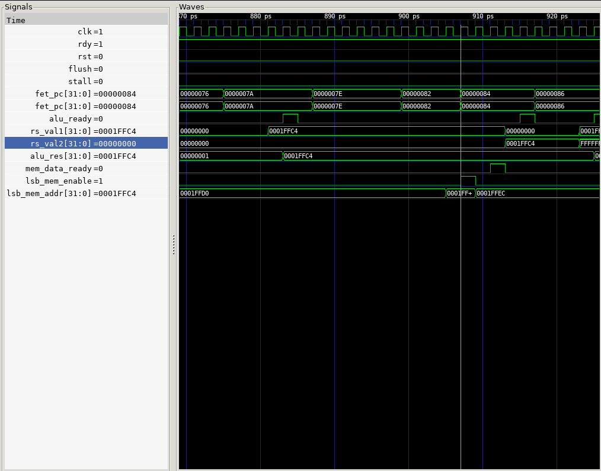

以下代码片段是 `sim/002_expr.dump` 的一部分：

```
7e:	0007c683          	lbu	a3,0(a5)
82:	873e                mv	a4,a5
```

在执行到 `lbu` 指令之前，`a5` 寄存器中的值为 `0x0001FFC4` 。



在波形图中可知：`mv` 指令在 `881 ps` 开始执行，一个周期后 ALU 计算出结果（波形图中可以看到 `alu_res = Reg[a5] + 0 = 0x0001FFC4`）。而 `lbu` 指令在 `907 ps` 开始执行（在波形图中可以看到此时 LSB 发给 MemCtrl 的 load 地址为 `0x0001FFC4`），两个周期后 MemCtrl 完成 load byte 操作（波形图中可以看到 `mem_data_ready = 1`）。在程序中 `lbu` 指令比 `mv` 早发射，但执行完毕的时间更晚，可见 CPU 实现了乱序执行。